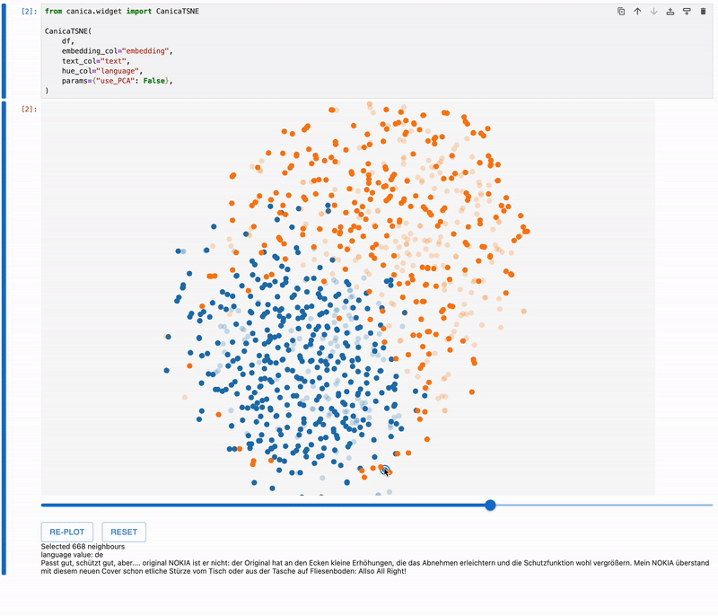

# canica
**canica** is an interactive tool to visualize embeddings. Its main current goal is to explore text datasets, representing the input embeddings in a 2D tSNE plot.



## How to install
Just
```sh
pip install canica
```

And start using the `CanicaTSNE` and `CanicaUMAP` class in your notebooks.

## How to use
canica is designed to work mainly as a data exploration tool embedded as a widget inside of a jupyter notebook. These are the instructions to explore a dataset in a notebook ([the tutorial notebook](./tutorial.ipynb) provides more information).

In a notebook, load a pandas DataFrame and make sure that at least one column contains the embeddings you want to plot.
In a cell, run:
```python
from canica.widget import CanicaTSNE
CanicaTSNE(df, embedding_col="embedding_col", text_col="text_col", hue_col="some_score")
```
Where `df` is the pandas DataFrame, `"embedding_col"` is a column in `df` containing embeddings and `hue_var` is another column that will be represented using colours (currently it has to be a numerical column with values between 0 and 1).
You can also use `CanicaUMAP` instead of `CanicaTSNE` to use UMAP.

This will show the canica embedding explorer and will enable interactive exploration of your dataset. Have a look at the [tutorial](./tutorial.ipynb) notebook to see it working.

## How to contribute
We welcome contributions of all kinds. For more information on how to do it, we refer you to the [CONTRIBUTING.md](./CONTRIBUTING.md) file.
